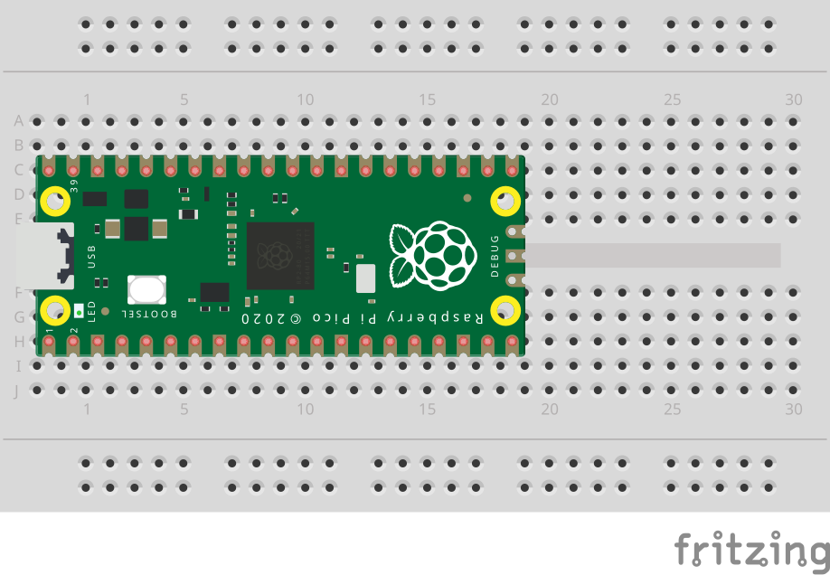

<div style="text-align: center">

</div>

# `rp2040-remote`

Debugging an rp2040 board with an raspberry pi as an server via your own computer.

## Setup

### Requirements

- `vscode` with the recommended extensions
- `cmake` to manage project toolchains and build process
- `git` to clone this project and manage `pico-sdk` submodule
- `raspberry pi` to connect some wires to the pico board

### Initial code setup

```bash
$ git clone https://github.com/oltdaniel/rp2040-remote
$ cd rp2040-remote
$ mkdir build
$ cd build
$ cmake .. -DCMAKE_BUILD_TYPE=Debug
$ code ..
```

### Raspberry PI setup

1. Open the Getting Started Guide from the Raspberry PI Foundation ([see here](https://datasheets.raspberrypi.com/pico/getting-started-with-pico.pdf)).
2. Follow step `5.2` and wire the pico board to your raspberry.
3. Follow step `5.1` and build your `openocd`.
4. Go back to your home `cd ~`.
5. Create a remote cfg with `echo "bindto 0.0.0.0" > remote.cfg`.
6. Start the server with `openocd -f interface/raspberrypi-swd.cfg -f target/rp2040.cfg -f ./remote_ocd.cfg`.

### First build

1. Write your code in the `src/main.c`.
2. Press `F5`, enter the raspberry pi IP.
3. Done.

> **Tip**: In order to avoid entering the IP multiple times, just click the restart button in the debugging Tool. It will rebuild, flash and restart the project.

## License

_just do what you'd like to do_

MIT LICENSE